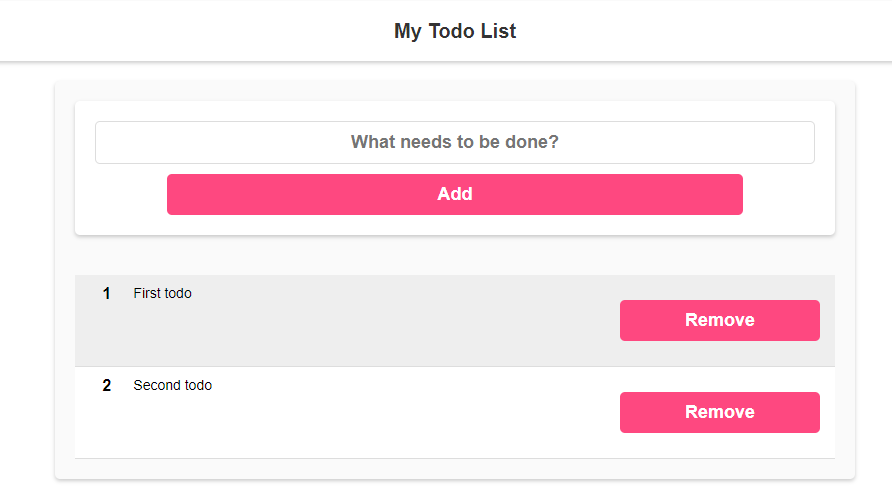
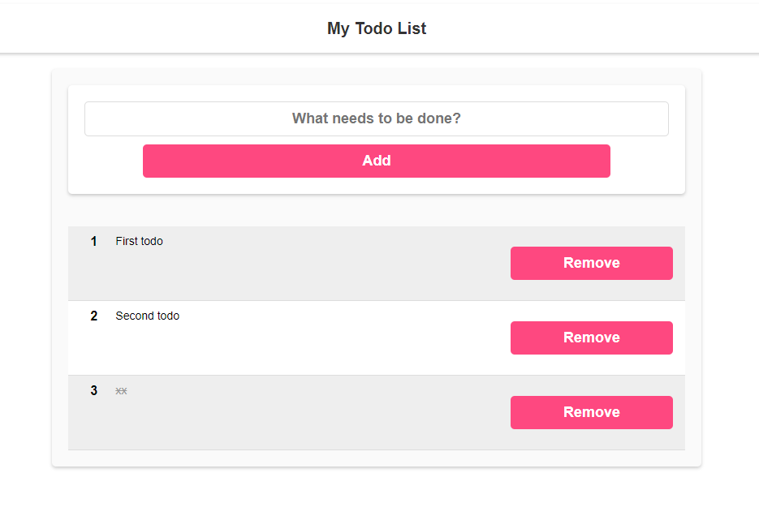

# TODOAPP

I made a simple to-do list using Angularjs

## Screenshots

## For Created new APP

npm i -g @angular/cli --> for installation angular
ng new [PROJECT_NAME] --directory ./ --> for create a new project for this folder

## Create Components Folder and includes

ng generate component  components/Todos || ng g c components/Todos

--> create components/Todos folder and files

### For Include

<app-todos></app-todos>

